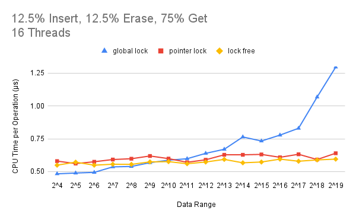
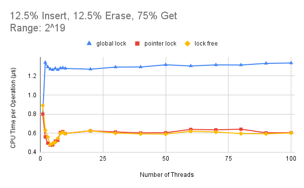

# Concurrent-Lock-free-Skip-List
Final course project for CMU [15-618 Parallel Computer Architectures and Programming (Fall 2021)](http://www.cs.cmu.edu/afs/cs/academic/class/15418-f21/www/). More details are shown in our [project webpage](https://lizidong2015.wixsite.com/15618)
## Requirements
### Garbage Collector Library
- Since lazy deletion is performed in our pointer-lock and lock-free implementations, [Boehm Garbage Collector](https://hboehm.info/gc/) library is required.
- Execute the following commands:
```bash
git clone git://github.com/ivmai/bdwgc.git
cd bdwgc
git clone git://github.com/ivmai/libatomic_ops.git
./autogen.sh
./configure --prefix=ABSOLUTE_PATH_OF_THIS_REPO/gc --enable-threads=posix --enable-thread-local-alloc --enable-parallel-mark --enable-cplusplus
make
make install
make check
```

## Test Suites
### Correctness
Execute the corresponding command in the ```Makefile``` to check the correctness of the implementation. For instance, run the test suite to check the correctness of the lock-free implementation:
```bash
make test_lock_free
```
### Performance
Execute the following commands to get the performance results measured by mean CPU time per operation:
```bash
make test_performance_2
```
This test suite fixes the total data range to 2^19 and varies the thread count from 1 to 100. You can also run:
```bash
make test_performance_3
```
This test suite fix the thread count to 16 and varies the data range from 2^4 to 2^19.

## Results

